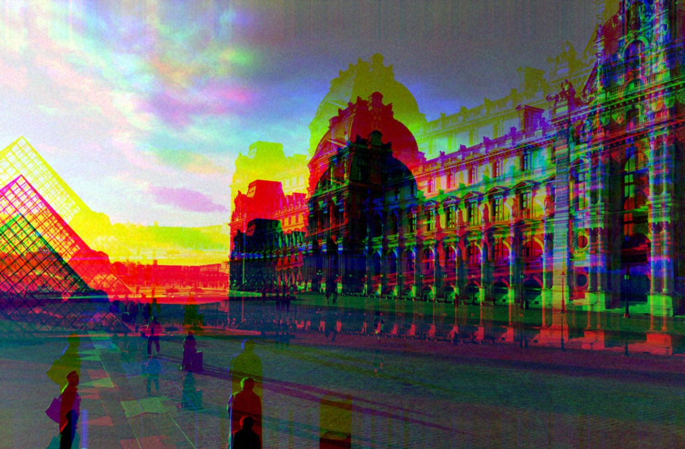

### 卄乇ㄥㄥㄖ, 几乇尺ᗪ丂.

This is not my main Git. I only put here private projects, resources for my students (courses, exercises, corrections...) and I often contribute to free softwares development. To avoid possible problems related to [centralization](https://www.eff.org/deeplinks/2020/11/riaa-abuses-dmca-take-down-popular-tool-downloading-online-video) and [state censorship](https://en.wikipedia.org/wiki/Censorship_of_GitHub), I self-host most of my services, including [my own Gitea instance](https://git.mezzart.fr/sqyqh). __Try it, you'll adopt it!__

__H/ppy h/cking!__
